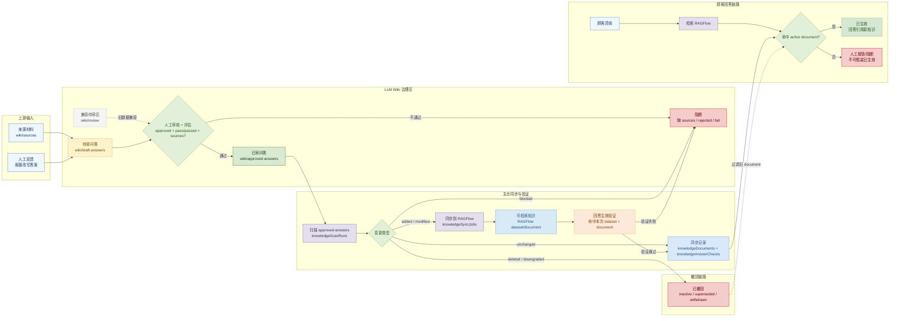
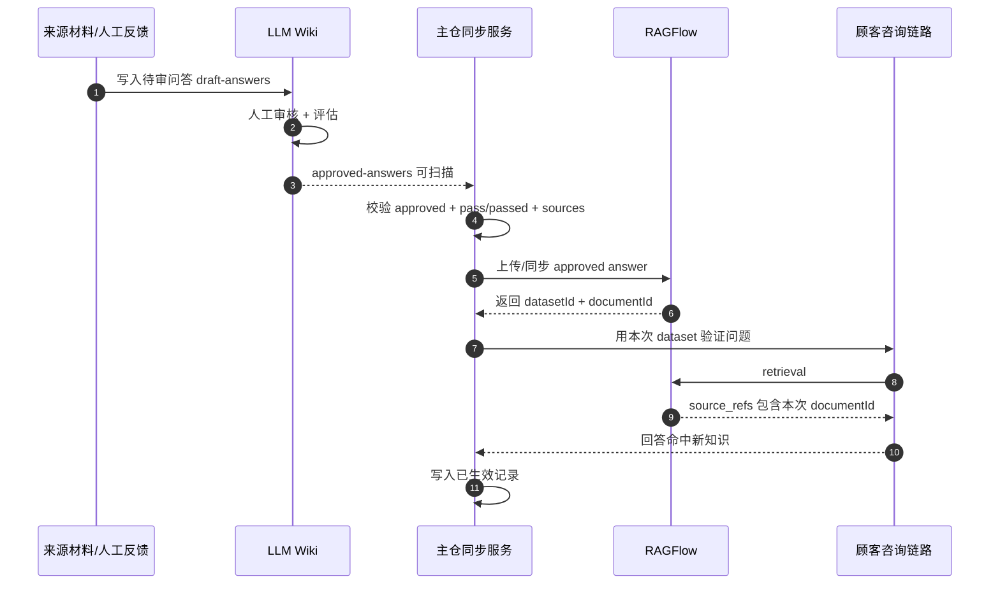

# LLM Wiki -> RAGFlow -> 回答生效闭环图

状态：当前有效。

用途：把“知识进入 LLM Wiki 后，如何经过审核、同步、验证，最终影响顾客回答”的生产闭环画清楚，避免把本地 demo publish 与真实生效路径混淆。

## 主闭环

## 时序透镜

## 读图规则

- `wiki/draft-answers` 是新候选默认写入区，`wiki/review` 只表示旧数据兼容。
- 只有 `wiki/approved-answers` 中满足 `approved + pass/passed + sources` 的问答可以进入 RAGFlow 同步。
- `已生效` 不是“同步成功”，而是“回答验证命中本次同步 dataset/document”。
- `已撤回` 依赖 `knowledgeDocuments` 的 active/inactive 状态过滤，避免旧 document 继续影响回答。
- 本地 `publish-local` / `publishedKnowledge` 是 demo fallback，不属于本生产闭环。
